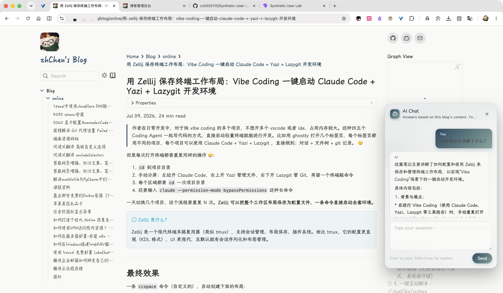
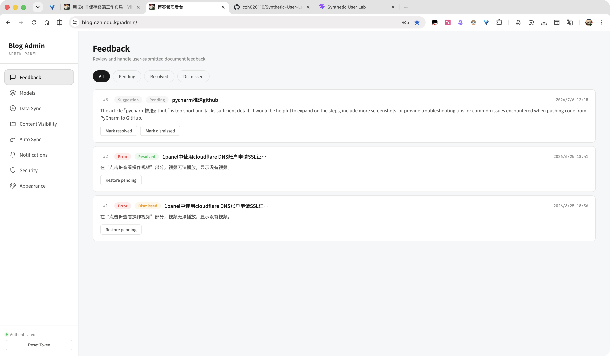
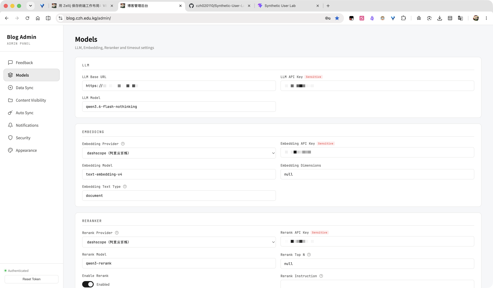
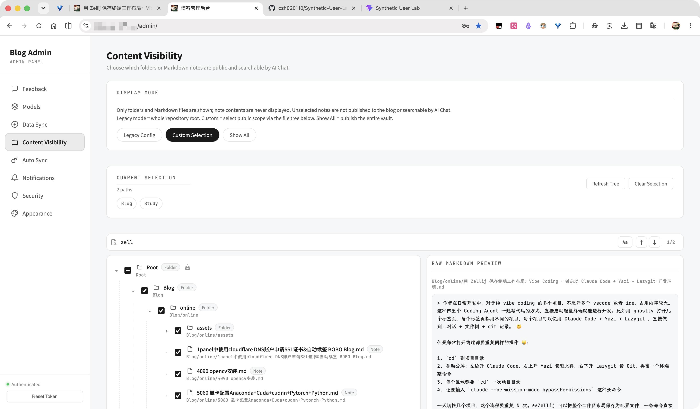

# Blog

基于 **Obsidian + Quartz + FastAPI + RAG** 的单机轻量知识博客：本地用 Obsidian 写作，笔记自动同步到服务器，Quartz 构建静态博客，FastAPI 提供 AI 问答（RAG 检索增强），Docker Compose 一键部署。

> 工作流：Obsidian 写作 → 远程同步（COS / GitHub）→ Quartz 静态博客 + AI 问答


---

## 功能特性
- **静态博客**：Quartz 构建，原生支持 Obsidian 的 `[[双链]]`、标签、callout、嵌入等
- **AI 问答**：博客右下角浮窗，基于 RAG（LlamaIndex + Chroma + Reranker）回答与笔记内容相关的问题，SSE 流式输出
- **远程笔记同步**：支持腾讯云 COS 或 GitHub 仓库作为只读笔记源，自动拉取（webhook 或定时）
- **内容可见性管理**：管理后台勾选要发布的目录/文件，未选中的笔记不会出现在博客与索引中
- **管理后台**：`/admin/` 可视化管理环境配置、外观、内容可见性、用户反馈、同步状态
- **多语言**：博客与管理后台支持 en-US / zh-CN / ja-JP 切换
- **外观定制**：背景颜色预设、导航栏与目录栏字体设置
- **反馈与通知**：用户反馈收集，新反馈或同步失败时可选邮件提醒




---

## 架构概览

```text
Obsidian → COS / GitHub → 服务器拉取 Markdown(data/notes)
                              ├→ Quartz 构建静态站(public 卷) → nginx 托管
                              └→ LlamaIndex → Chroma(嵌入式) → /api/chat RAG 问答

浏览器 → nginx(:80, 对外 18088) ─┬→ /        静态博客
                                 ├→ /admin/  管理后台
                                 └→ /api/    FastAPI（chat / reindex / webhook）
```

compose 编排两个服务：

| 服务 | 说明 |
|------|------|
| `blog` | 常驻主服务。supervisord 管理 nginx + uvicorn(FastAPI)，syncer/notifier 为后台线程。对外暴露 `18088:80` |
| `web` | Quartz 构建器。读取 `data/notes` 构建静态站到 `public` 卷后退出（非常驻） |

> Chroma 为嵌入式模式（运行在 api 进程内），不单独起容器。

---

## 目录结构

```text
Blog/
  compose.yaml            # 服务编排（blog 常驻 + web 构建）
  .env / .env.example     # 环境配置（.env 不进 Git）
  apps/
    api/                  # FastAPI + RAG 后端（supervisord 管 nginx + uvicorn）
      app/                # main / chat / retriever / indexer / syncer / admin / ...
      nginx/              # 容器内 nginx 配置
      Dockerfile
    web/                  # Quartz 静态站构建
      quartz.config.yaml
      Dockerfile
    admin/                # 管理后台静态页（挂载到 nginx /admin/）
  data/                   # 运行时数据（单独挂载，不进 Git）
    notes/                # 笔记源 Markdown
    chroma/               # 向量库持久化
    blog.db               # SQLite（反馈等）
    appearance.json       # 外观配置
    content_visibility.json
    public_content_manifest.json
  scripts/                # 宿主机运维脚本：sync.sh / rebuild.sh / deploy.sh
  scf/                    # 腾讯云 SCF webhook 转发（COS 事件触发同步）
  PLUGIN_SETUP.md         # Quartz 插件安装与镜像加速指南
```

---

## 环境要求

- Docker & Docker Compose
- 至少 2GB 可用磁盘（构建镜像 + 向量数据）
- 建议 ≥ 4GB 内存；内存紧张时建议增加 Swap（embedding 构建有内存峰值）
- 外部 LLM / Embedding / Reranker API（不在本机推理大模型）

---

## 快速开始

### 1. 克隆仓库

```bash
git clone https://github.com/czh020110/QZ2AI.git Blog && cd Blog
```

### 2. 配置环境变量

```bash
cp .env.example .env
```

编辑 `.env`，至少填入以下必填项（完整说明见文件内注释）：

| 变量 | 说明 |
|------|------|
| `LLM_BASE_URL` / `LLM_API_KEY` / `LLM_MODEL` | LLM API（OpenAI 兼容接口） |
| `EMBEDDING_PROVIDER` / `EMBEDDING_API_KEY` / `EMBEDDING_MODEL` | Embedding API（默认阿里云百炼 dashscope） |
| `RERANK_API_KEY` / `RERANK_MODEL` | Reranker（百炼），`RERANK_ENABLED=true` 时启用 |
| `REINDEX_TOKEN` | `/api/reindex` 保护 token（留空则拒绝公网调用） |
| `ADMIN_TOKEN` | 管理后台接口保护 token（留空则拒绝调用） |
| `REMOTE_TYPE` | 笔记源类型：`cos` 或 `github` |
| `ALLOWED_ORIGINS` | CORS 放行的博客域名（多个逗号分隔） |

按所选笔记源补充同步配置：

- **COS**（`REMOTE_TYPE=cos`）：`COS_SECRET_ID` / `COS_SECRET_KEY` / `COS_REGION` / `COS_ENDPOINT` / `COS_BUCKET`
- **GitHub**（`REMOTE_TYPE=github`）：`GITHUB_REPO_URL` / `GITHUB_BRANCH` / `GITHUB_TOKEN`（私有仓库必填）

### 3. 准备笔记内容

二选一：

- **手动放置**：将 Markdown 笔记（支持子目录）放入 `data/notes/`
- **远程同步**：按上一步配置好 COS / GitHub，启动后由 syncer 自动拉取

### 4. 启动服务

```bash
docker compose up -d --build
```

首次构建镜像约 3–5 分钟。`web` 会先构建静态站，完成后 `blog` 主服务启动。

### 5. 构建索引并配置可见内容

服务启动后构建向量索引（增量更新，非全量重建）：

```bash
curl -X POST "http://localhost:18088/api/reindex" \
  -H "Authorization: Bearer <你的REINDEX_TOKEN>"
```

返回 `{"status":"ok",...}` 即成功。

然后访问管理后台 **Content Visibility** 勾选要发布的目录/文件，保存后会自动重建静态站与索引。

### 6. 访问

| 地址 | 说明 |
|------|------|
| `http://<IP>:18088/` | 博客首页 |
| `http://<IP>:18088/admin/` | 管理后台（需 `ADMIN_TOKEN` 登录） |

博客页面右下角的 AI 助手浮窗可直接问答。

---

## 配置说明

所有配置通过 `.env` 管理，`.env.example` 内有逐项注释。主要分组：

- **LLM / Embedding / Reranker API**：模型调用与超时重试参数
- **数据目录**：`NOTES_DIR` / `CHROMA_DIR` / `DB_PATH` 等（容器内路径，默认无需改）
- **检索参数**：`SIMILARITY_TOP_K` 等
- **联调开关**：`LLM_MOCK=true` 时返回固定文本不调真实 API（控费/前端联调）
- **接口保护**：`REINDEX_TOKEN` / `ADMIN_TOKEN`
- **远程笔记同步**：COS / GitHub 凭证与参数
- **自动同步**：`AUTO_SYNC_ENABLED` + `SYNC_INTERVAL_SECONDS` 组合表达三种策略（见下）
- **反馈邮件通知**：SMTP 配置与开关
- **CORS**：`ALLOWED_ORIGINS`

### 自动同步策略

| 策略 | 配置 | 适用 |
|------|------|------|
| 自动同步（push 触发） | `AUTO_SYNC_ENABLED=true` + `SYNC_INTERVAL_SECONDS=0` | GitHub 推荐 |
| 定时同步（轮询拉取） | `AUTO_SYNC_ENABLED=true` + `SYNC_INTERVAL_SECONDS=1800` | COS 推荐 |
| 手动同步 | `AUTO_SYNC_ENABLED=false` | 仅后台按钮触发 |

启用自动同步时需设置 `WEBHOOK_SECRET`，webhook 端点据此校验请求。

---

## 笔记同步

syncer 仅做**只读拉取**（远端 → 本地 `data/notes`），不支持本地上传；远端为唯一权威来源，远端已删除的文件会从本地删除。

- **COS**：通过 coscli 从桶同步；也可配置 `COSCLI_CONFIG_PATH` 复用已有 coscli 配置
- **GitHub**：`git clone` / `git pull` 只读拉取；`GIT_PROXY` 可设代理，`GIT_ACCELERATOR` 可设 GitHub 加速镜像
- **SCF webhook**：`scf/` 提供腾讯云云函数，用于将 COS 事件转发到 Blog API 的 webhook 端点触发自动同步（详见 `scf/README.md`）

---

## 常用运维操作

```bash
# 更新笔记后增量重建索引
curl -X POST "http://localhost:18088/api/reindex" \
  -H "Authorization: Bearer <REINDEX_TOKEN>"

# 查看服务日志
docker compose logs -f blog

# 重启主服务
docker compose restart blog

# 重新构建并启动
docker compose up -d --build

# 手动触发远程同步（宿主机脚本）
bash scripts/sync.sh
```

管理后台 `/admin/` 可可视化完成：环境配置修改、内容可见性管理、外观与字体设置、反馈查看、同步状态监控、手动触发同步与重建。

---

## API 速查

| 方法 | 路径 | 说明 |
|------|------|------|
| GET | `/api/health` | 健康检查 |
| POST | `/api/chat` | AI 问答（SSE 流式） |
| POST | `/api/reindex` | 增量重建索引（需 `REINDEX_TOKEN`） |
| POST | `/api/webhook/sync` | GitHub push 事件 webhook（需 `WEBHOOK_SECRET`） |
| POST | `/admin/api/webhook/cos` | COS 事件 webhook（需 `WEBHOOK_SECRET`） |
| GET | `/api/appearance` | 读取外观配置（公开） |
| — | `/admin/api/*` | 管理接口（需 `ADMIN_TOKEN`，建议通过管理后台操作） |

---

## 相关文档

- [PLUGIN_SETUP.md](./PLUGIN_SETUP.md) — Quartz 插件安装与 GitHub 镜像加速
- [scf/README.md](./scf/README.md) — 腾讯云 SCF webhook 转发配置
